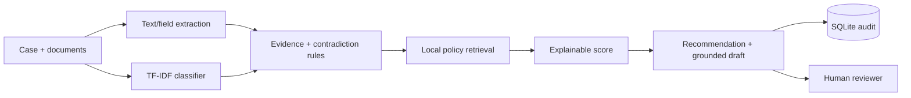

# DisputeShield AI

Explainable Chargeback Evidence Intelligence for Merchants — an independent defensive prototype for the Razorpay AI Buildathon 2026, Track 2. It is not an official Razorpay product and does not imply endorsement.

## Problem and features

Merchants need to assemble truthful, consistent evidence under time pressure. DisputeShield classifies the reason with explainable TF-IDF + logistic regression, extracts uploaded evidence, flags missing and contradictory facts, retrieves grounded policy passages, calculates a transparent 0–100 decision-support score, recommends safe next actions, drafts only from supplied facts, escalates uncertainty, and records an audit trail.

Nine Streamlit views cover the overview, new-case workflow, evidence report, policy evidence, held-out evaluation, threshold/cost lab, failure analysis, audit records, and responsible AI. PDF/TXT/CSV/JPG/PNG uploads are supported; OCR degrades safely when Tesseract is absent.



## Install and run

```bash
python -m venv .venv
```

Windows:

```powershell
.venv\Scripts\activate
```

macOS/Linux:

```bash
source .venv/bin/activate
```

```bash
pip install -r requirements.txt
python scripts/generate_synthetic_data.py
python scripts/train_model.py
python scripts/evaluate_model.py
pytest -q
streamlit run app.py
```

## Dataset and evaluation

The generator uses seed 42 to create 1,600 clearly labelled synthetic cases across all eight reasons, including typos, ambiguity, missing evidence, contradictions, and varied INR values. Case-level records are shuffled once and split 70/15/15 into 1,120 training, 240 validation, and 240 held-out test cases; an imbalanced variant is also supplied. No held-out text is used in training.

`evaluate_model.py` writes genuine metrics to `data/evaluation_report.json`, including accuracy, per-class precision/recall/F1, confusion matrix, escalation rate, false positives/negatives, and cost. Estimated cost is `false negatives × average held-out chargeback amount + false positives × ₹300 manual-review cost`. The UI reads these artifacts and never hard-codes model performance.

Current reproducible held-out result (240 synthetic cases): accuracy 100%. Because the synthetic descriptions use deliberately separable phrase families, this is a baseline sanity check—not evidence of production performance. Confidence-only escalation was 0%, producing 116 false negatives against the broader synthetic review label and an estimated cost of ₹4,415,095.52 at an average case value of ₹38,061.17. This exposes why the live pipeline also escalates missing evidence, contradictions, unreadable documents, and weak evidence scores. Evidence and contradiction rules achieved 100% precision/recall only on rule-covered synthetic labels. Seven automated tests pass.

## Score

Required completeness 40%, consistency 25%, relevance 15%, classification confidence 10%, and retrieved policy support 10%, less explicit penalties for missing critical items, major contradictions, and unreadable documents. Scores of 75–100 are strong, 50–74 need improvement, and below 50 are weak. Low confidence, unreadable files, weak scores, and serious contradictions trigger human review. A score is not a prediction or guarantee.

## Five-minute demo

1. Open Overview and explain the safety boundary.
2. Enter a delivery dispute in Analyze New Case and upload invoice/order/delivery TXT or PDF files.
3. Correct extracted JSON, label evidence types, and run analysis.
4. Show influential classifier terms, missing evidence, contradictions, score breakdown, policy citations, and grounded draft.
5. Record the reviewer decision, then show held-out metrics and threshold/cost trade-offs.

## Screenshots

Add screenshots from a local verified run to `assets/` before submission: overview, analysis result, evidence report, and threshold lab.

## Responsible AI, limitations, future work

The app never submits a response, blocks a customer, alleges fraud, invents evidence, hides contradictions, or promises an outcome. Drafts require merchant review; uncertain cases fail safely. SQLite preserves inputs and decisions for accountability.

This prototype uses synthetic rather than production-calibrated data; regex extraction is format-sensitive; optional OCR depends on a local Tesseract executable; policy retrieval is lexical; rules cannot cover every real-world conflict. Future work includes privacy-preserving production validation, calibrated probabilities, document-layout models, richer identity/date reconciliation, role-based access, encrypted storage, and expert-approved jurisdiction-specific policy packs.
